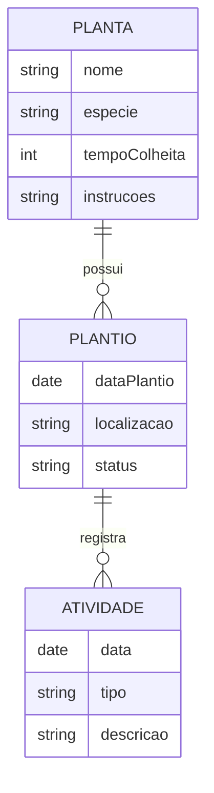

<div align="center">

# 🌱 HORTA - Sistema de Gerenciamento de Plantio

[](https://nextjs.org/)
[](https://www.prisma.io/)
[](https://tailwindcss.com/)
[](https://www.typescriptlang.org/)
[](https://www.sqlite.org/)

<p align="center">
  
  Sistema moderno para gerenciamento e organização de plantio
</p>

</div>

## 📋 Índice

- [Sobre o Projeto](#-sobre-o-projeto)
- [Tecnologias Utilizadas](#-tecnologias-utilizadas)
- [Funcionalidades](#-funcionalidades)
- [Começando](#-começando)
- [Estrutura do Banco de Dados](#-estrutura-do-banco-de-dados)
- [Contribuição](#-contribuição)
- [Licença](#-licença)
- [Contato](#-contato)

## 🌿 Sobre o Projeto

O HORTA é um sistema de gerenciamento de plantio desenvolvido com tecnologias modernas para auxiliar no controle e organização de cultivos. Com uma interface intuitiva e recursos poderosos, o sistema permite o acompanhamento detalhado de suas plantações.

## 🚀 Tecnologias Utilizadas

- **Next.js** - Framework React para produção
- **Prisma** - ORM moderno para banco de dados
- **Tailwind CSS** - Framework CSS utilitário
- **TypeScript** - Superset JavaScript com tipagem
- **SQLite** - Banco de dados relacional

## ✨ Funcionalidades

- 📱 Interface responsiva e moderna
- 🗃️ Gerenciamento de cultivos
- 📊 Acompanhamento de crescimento
- 🌡️ Monitoramento de condições
- 📅 Calendário de plantio
- 📝 Registro de atividades

## 🏁 Começando

```bash
# Clone o repositório
git clone https://github.com/seu-usuario/horta.git

# Entre no diretório
cd horta

# Instale as dependências
npm install

# Configure as variáveis de ambiente
cp .env.example .env

# Execute as migrações do banco de dados
npx prisma migrate dev

# Inicie o servidor de desenvolvimento
npm run dev
```

## 🗄️ Estrutura do Banco de Dados



## 🤝 Contribuição

Contribuições são sempre bem-vindas! Por favor, leia o guia de contribuição antes de submeter alterações.

## 📄 Licença

Este projeto está sob a licença MIT. Veja o arquivo [LICENSE](LICENSE) para mais detalhes.

## 📬 Contato

Se você tiver alguma dúvida sobre este projeto, sinta-se à vontade para entrar em contato:

[](https://linkedin.com/in/seu-perfil)
[](https://github.com/seu-usuario)

---

<div align="center">
Feito com 💚 pela equipe HORTA
</div>
